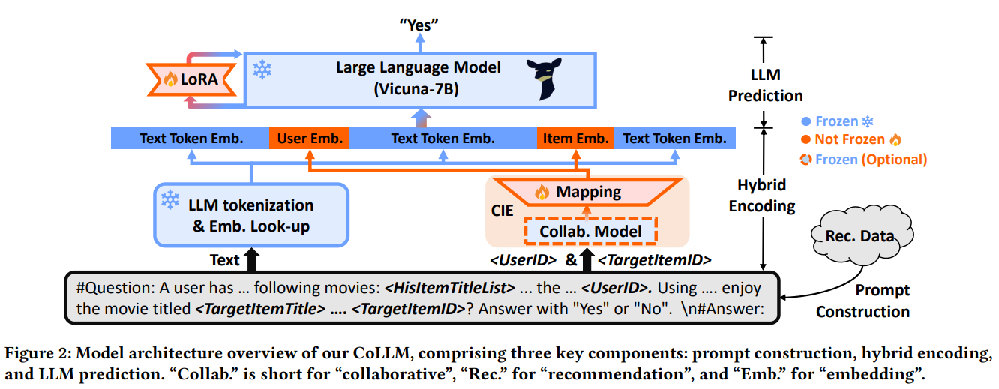

# CoLLM-FaissRet: Integrating Collaborative Information as a Modality with Efficient Faiss Retrieval for Recommendation
Chuhong Zheng. 

**University of California, San Diego**

**This repository is constructed based on [MiniGPT-4](https://github.com/Vision-CAIR/MiniGPT-4)!**

## Introduction
We propose CoLLM-FaissRet, an improved approach that treats collaborative information as a separate modality and integrates it into LLMs through direct mapping, incorporating Faiss for efficient retrieval to better handle large-scale cold-start and warm-start recommendation scenarios. Similar to existing approaches (e.g., TALLRec), CoLLM-FaissRet starts by converting recommendation data into language prompts (prompt construction), which are then encoded and inputted into an LLM to generate recommendations (hybrid encoding and LLM prediction). We have  specific designs for incorporating collaborative information:

- When constructing prompts, we add user/item ID fields in addition to text descriptions to represent collaborative information.

- When encoding prompts, alongside the LLMs’ tokenization and
embedding for encoding textual information, we employ a conventional collaborative model to generate user/item representations that capture collaborative information, and map them into the token embedding space of the LLM, which are achieved by the FECE module in the figure.

For training, we take a two-step tuning method:

- Tuning the LoRA Module with the text-only input.

- Tuning the FECE module with both the text and user/item ID data.




## Getting Started
### Installation

**1. Prepare the code and the environment**

Git clone our repository, creating a python environment and ativate it via the following command

```bash
git clone https://github.com/ChuhongZheng/CoLLM-FaissRet.git
cd CoLLM-FaissRet
conda env create -f environment.yml
pip install -r requirements.txt
conda activate minigpt4
```

***Code Structure:*** 

---

├──minigpt4: Core code of CoLLM, following the structure of MiniGPT-4.
    ├── models: Defines our CoLLM model architecture.
    ├── datasets: Defines dataset classes.
    ├── task: A overall task class, defining the used model and datasets, training epoch and evaluation.
    ├── runners: A runner class to train and evaluate a model based on a task.
    ├── common: Commonly used functions.
├──dataset: Dataset pre-processing.
├──prompt: Used prompts.
├──train_configs: Training configuration files, setting hyperparameters.
├──train_collm_xx.py CoLLM training file.
├──baseline_train_xx.py: Baseline training file.

---

**Note:** For the meaning of the parameters involved in train_configs, please read the comments of collm_pretrain_mf_ood.yaml. The parameters in other train_config files have the same meaning.

**2. Prepare the pretrained Vicuna weights**

The current version of CoLLM-FaissRet is built on the v0 versoin of Vicuna-7B.

To prepare Vicuna’s weight, first download Vicuna’s **delta** weight from [https://huggingface.co/lmsys/vicuna-13b-delta-v0](https://huggingface.co/lmsys/vicuna-13b-delta-v0). 
In case you have git-lfs installed (https://git-lfs.com), this can be done by

```bash
git lfs install
git clone https://huggingface.co/lmsys/vicuna-13b-delta-v0  # more powerful, need at least 24G gpu memory
# or
git clone https://huggingface.co/lmsys/vicuna-7b-delta-v0  # smaller, need 12G gpu memory
```

Note that this is not directly the working weight, but the difference between the working weight and the original weight of LLAMA-13B. (Due to LLAMA’s rules, we cannot distribute the weight of LLAMA.)

Then, you need to obtain the original LLAMA-7B or LLAMA-13B weights in the HuggingFace format 
either following the instruction provided by HuggingFace [here](https://huggingface.co/docs/transformers/main/model_doc/llama) or from the Internet. 

When these two weights are ready, we can use tools from Vicuna’s team to create the real working weight.

```bash
python -m fastchat.model.apply_delta --base /path/to/llama-13bOR7b-hf/  --target /path/to/save/working/vicuna/weight/  --delta /path/to/vicuna-13bOR7b-delta-v0/
```

The final weights would be in a single folder in a structure similar to the following:

---

vicuna_weights
├── config.json
├── generation_config.json
├── pytorch_model.bin.index.json
├── pytorch_model-00001-of-00003.bin
...   

---

Then, set the path to the vicuna weight in the `"llama_model" ` field of a traing config file, e.g., [here](train_configs/collm_pretrain_mf_ood.yaml#L15)  for CoLLM-FaissRet.

**3. Prepare the Datasets**

You can process the data yourself using the code provided in the ```./dataset``` directory. Alternatively, you can download our pre-processed data from [here](collm-datasets/).

### Training
The training of CoLLM-FaissRet contains two stages:

**1. LoRA Tuning**

To endow the cold-start recommendation capabilities of LLM, our initial focus is on fine-tuning the LoRA module to learn recommendation tasks independently of collaborative information. That is, we solely utilize the text-only segment of the prompt (e.g., "prompt_/tallrec_movie.txt") to generate predictions and minimize prediction errors for tuning the LoRA module to learning recommendation.

When implementing, you need to set the hyper-parameters in the training config file (e.g., [train_configs/collm_pretrain_mf_ood.yaml](train_configs/collm_pretrain_mf_ood.yaml)) as follows:
```yaml
- freeze_rec: True # freeze the collaborative rec model
- freeze_proj: True  # freeze the mapping function or not
- freeze_lora: False # tuning the LoRA module
- prompt_path: "prompt_/tallrec_movie.txt" # use the prompt without the user/item IDs
- ckpt: None # without pretrained LoRA and FECE (LoRA), you can also directly delete this hypee-parameter 
- evaluate：False #set training
```

To launch the first stage training, run the following command. In our experiments, we use 2 RTX 4090. 
```bash
CUDA_VISIBLE_DEVICES=6,7 WORLD_SIZE=2 nohup torchrun --nproc-per-node 2 --master_port=11139 train_collm_mf_din.py  --cfg-path=train_configs/collm_pretrain_mf_ood.yaml > /log.out &
```

**2. FECE Tuning**

In this step, we tune the FECE module while keeping all other components frozen The objective of this tuning step is to enable the FECE module to learn how to extract and map collaborative information effectively for LLM usage in recommendations. To achieve this, we utilize prompts containing user/item IDs to generate predictions and tune the FECE model to minimize prediction errors. 
When implementing, you need set the hyper-parameters in the training config file as follows:

```yaml
- freeze_rec: True # freeze the collaborative rec model
- freeze_proj: False  # tuning the mapping function or not
- freeze_lora: True # freeze the LoRA module
- pretrained_path: pretrained_collab_model_path # pretrained collab. model path 
- evaluate：False #set training
- prompt_path: "prompt_/collm_movie.txt" # use the prompt with the user/item IDs
- ckpt: step1_checkpoint_path # with pretrained LoRA
```
Then run the same command to the stage 1.


### Evaluation
Set the hyper-parameters in the training config file as follows:
```yaml
- ckpt: your_checkpoint_path # trained model path
- evaluate: True # only evaluate
```
Then run the same command to the first stage training.


## Acknowledgement

+ [MiniGPT4](https://github.com/Vision-CAIR/MiniGPT-4)、[CoLLM](https://github.com/zyang1580/CoLLM) Our repository is built upon MiniGPT-4 and CoLLM!
+ [Vicuna](https://github.com/lm-sys/FastChat) The fantastic language ability of Vicuna with only 13B parameters is just amazing. And it is open-source!


## License
This repository is under [BSD 3-Clause License](LICENSE.md).
Many codes are based on [MiniGPT-4]() with BSD 3-Clause License [here](LICENSE_minigpt4.md), which is build upon [Lavis](https://github.com/salesforce/LAVIS) with 
BSD 3-Clause License [here](LICENSE_Lavis.md).
